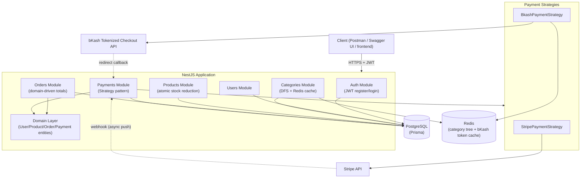
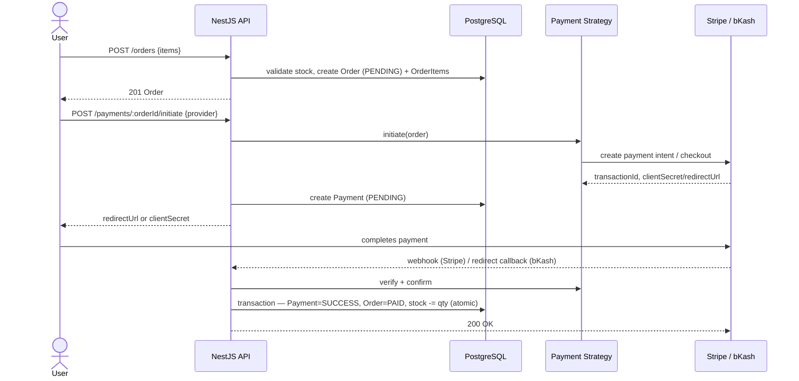

# System Architecture

## Overview



## Layering

```
Controller  → HTTP concerns only (guards, DTO validation, status codes)
Service     → orchestration: talks to Prisma, calls domain entities, calls strategies
Domain      → pure business rules (no I/O): OrderEntity, ProductEntity, PaymentEntity, UserEntity
Prisma      → persistence
Strategies  → third-party payment integration, swappable without touching Service/Domain
```

The domain layer has zero dependency on NestJS, Prisma, or HTTP — it's plain
TypeScript classes, which is exactly why `src/domain/*.spec.ts` can unit-test
the total-calculation and state-machine logic directly, with no database or
mocking required at all.

## Request flow: checkout end to end


