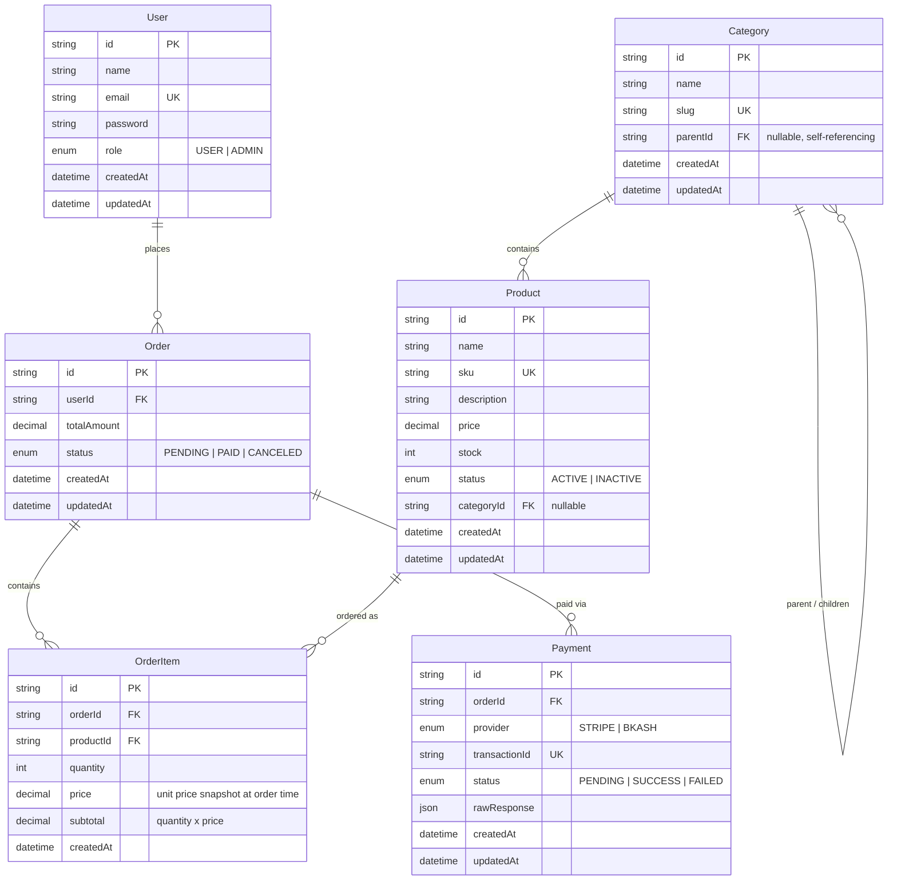

# Entity-Relationship Diagram

## Indexes (see `prisma/schema.prisma` for the authoritative source)

| Table | Index | Why |
|---|---|---|
| `categories` | `parentId` | every DFS traversal and tree build starts by grouping children by parent |
| `products` | `categoryId`, `status` | recommendation queries and the public product-list filter |
| `orders` | `userId`, `status` | "my orders" listing, and initiate-payment's status guard |
| `order_items` | `orderId`, `productId` | order detail joins, and per-product order history |
| `payments` | `orderId` | listing a user's payments joined through their orders |
| `payments.transactionId` | unique | the webhook/callback lookup key — must resolve in O(1) and reject duplicate provider transaction ids |

## Design notes

- **`Category` is self-referencing** (`parentId → Category.id`) rather than a separate closure table, since the tree depth here is small and the DFS traversal + Redis-cached flat list (see `CategoriesService`) makes repeated traversals cheap without needing a more complex nested-set or closure-table structure.
- **`OrderItem.price` is a snapshot**, not a live join to `Product.price` — an order's total must never change retroactively if a product's price changes later. This is also why `OrderItem.subtotal` is stored rather than always recomputed: it's the historical record of what was actually charged.
- **`Payment.transactionId` is globally unique** across both providers — this is what makes `PaymentsService.finalizePayment` a safe, idempotent lookup key for both Stripe's webhook and bKash's callback.
