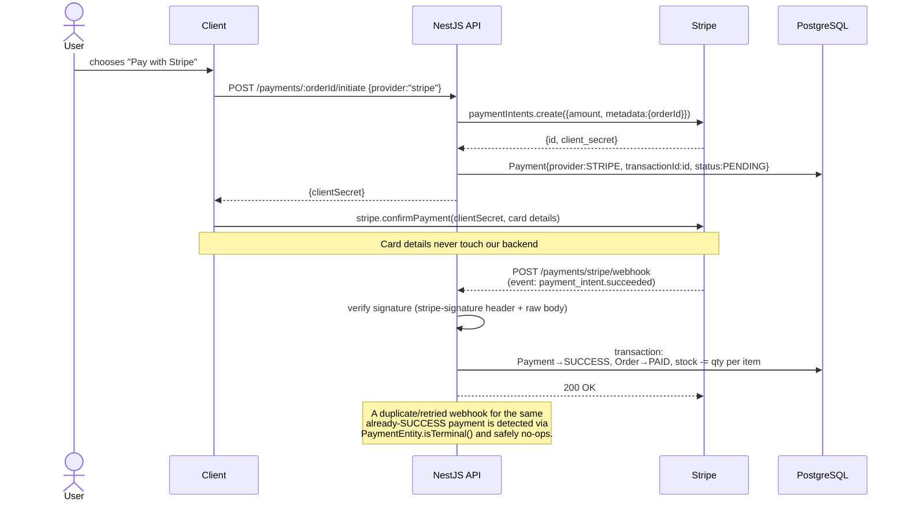
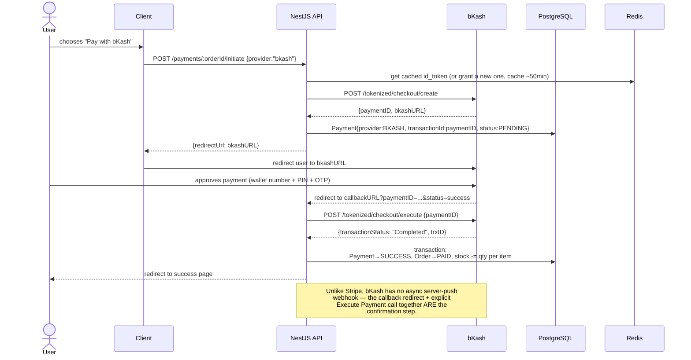

# Payment Flow Diagrams

## Stripe — async webhook confirmation

## bKash — callback + explicit execute

## Why the two flows are structured differently

| | Stripe | bKash |
|---|---|---|
| Confirmation trigger | Async server-to-server webhook, independent of the user's browser | Browser redirect back to our callback URL |
| Backend's role on confirmation | Verify signature, then trust the event | Verify nothing cryptographically — must call Execute Payment ourselves to get an authoritative status |
| Retry/duplicate risk | Stripe retries webhook delivery on non-2xx | A user could reload the callback URL |
| How this repo prevents double-processing | `PaymentEntity`'s state machine — `SUCCESS`/`FAILED` are terminal, so both paths funnel through one `PaymentsService.finalizePayment` and safely no-op on a repeat |

Both providers ultimately converge on the exact same code path
(`PaymentsService.finalizePayment`), so "mark paid, reduce stock" is
implemented and tested exactly once, not duplicated per provider.
